# Hieu Tran 
**Computer Engineering @ HCMUT | Aspiring NOC / Network Engineer**

***Transitioning from Computer Engineering to Network Operations. Leveraging a strong foundation in hardware, embedded systems, and full-stack development to master Network Infrastructure, Monitoring, and NetDevOps.***
---

###  Ping Me

###  Infrastructure & Tech Stack

**Networking & Systems:**

**Development & Scripting:**

**Frameworks & Libraries:**

**Database, DevOps & Tools:**

    

